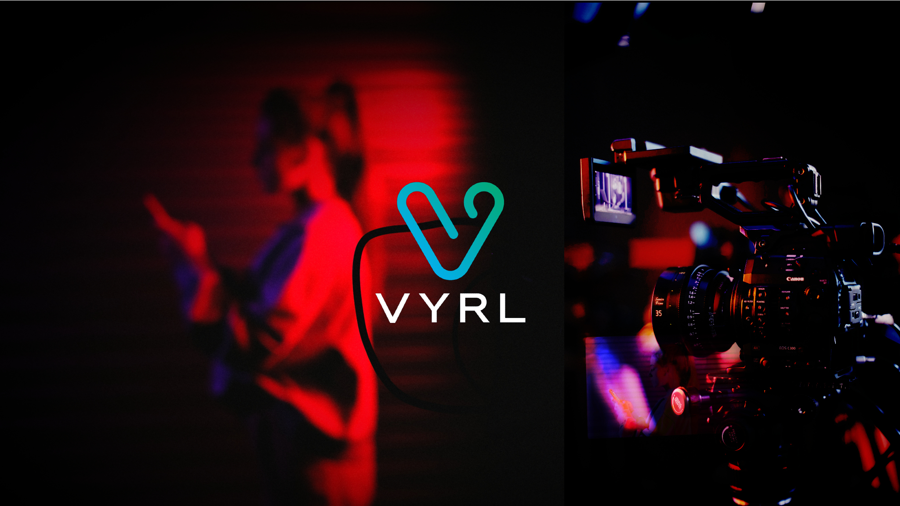

 
# AI Viral Video Generation

VYRL is an online presence, it is a [YouTube channel](https://www.youtube.com/channel/UC7xJpL8WWGUOxvbbHshcmQw) that shares the **best** and **funniest** videos aggregated from different social channels and creators from all over the web, including [Twitter](https://twitter.com/vyrl_videos), [Instagram Reels](https://www.instagram.com/vyrl_videos), and of course [Tik-Tok](https://www.tiktok.com/@vyrlvideos)! 
But BEST of all VYRL also generates it's own viral videos!

## Hey, What's this VYRL thing?
VYRL is a multi-faceted video production software package. It drives all the content published throughout its various channels online.
it is a system, it is a network of social accounts, primarily a [YouTube channel](https://www.youtube.com/channel/UC7xJpL8WWGUOxvbbHshcmQw) that shares the **best** and **funniest** videos aggregated from different social channels and creators from all over the web, including [Twitter](https://twitter.com/vyrl_videos), [Instagram Reels](https://www.instagram.com/vyrl_videos), and of course [Tik-Tok](https://www.tiktok.com/@vyrlvideos)! Buuuut VYRL also generates its own viral videos! It produces automated viral videos for relaxing/sleep instrumentals, rain/thunder videos, news article summaries, nature flyovers and much more!

## Okay, but like what's it made of??
VYRL is a total network of software. It includes the following components:

- Third-Party API interface streaming photo/video resources from services like [Pexels API](https://www.pexels.com/api/documentation/)
- Automated video production, encoding and editing utilizing CLI tools such as [FFMPEG](https://ffmpeg.org/)
- Automatic real-time Text-To-Speech script generation using [Say](https://www.npmjs.com/package/say)
- Annnnnd lots of other really cool but really *technical* gobblygook... :nerd_face:

## Uh-huh, Where can I find it?
You can find VYRL all over the web, but since you asked, specifically we have the following presence:
- **VYRL -- THe BEST Videos on the Web!** on [YouTube channel](https://www.youtube.com/channel/UC7xJpL8WWGUOxvbbHshcmQw) 
- **@vyrl_videos** on [Twitter](https://twitter.com/vyrl_videos) 
- **@vyrl_videos** on [Instagram Reels](https://www.instagram.com/vyrl_videos)
- **vyrlvideos** on [Tumblr](vyrlvideos.tumblr.com)
- **VYRLVideos** on [Reddit](https://www.reddit.com/user/VYRLVideos)
- **vyrlvideos** on [Tik-Tok](https://www.tiktok.com/@vyrlvideos) 

## Wow! So Why is this a thing?
VYRL has the potential to:
- Share the best viral video en masse automatically
- Viral videos will in turn drive up the total views and subscription counts on YouTube
- Monetization of our channel will occur at 1000 subscribers and 4000 public watch hours
- Ad revenue then will be accumulated from YouTube and Google AdSense being shown on the channel
- Various social channels will share viral content and redirect followers to the YouTube channel increasing engagement
- Automatically generated viral videos will then be produced on a regular schedule automatically generating a steady passive income stream
- Further future development will improve video quality, duration and expand the category content available for viewers!
- Potential to grow the channel into a network of channels hosting different subgenres VYRL Music, VYRL News, VYRL Nature etc.

## Also, I'm doing it for God
OK hear me out tho, I'm a Christian and well VYRL has a **HUGE** opportunity to push videos out to millions of subscribers concerning the Gospel!
Christian Tik-Tokers and other influencer's content could be mixed in with the top videos thus exposing unbelieving viewers to the saving truth of Jesus Christ.
:heart: :cross:

## Nice! So what if it all fails miserably??
It's cool. If anything else, this was a fun experiment concerning what code can do with AI video generation, production and composition
which also just happened to have the cool side effect of potentially getting the truth out to the masses and possible *passive income* for me and my growing family.

